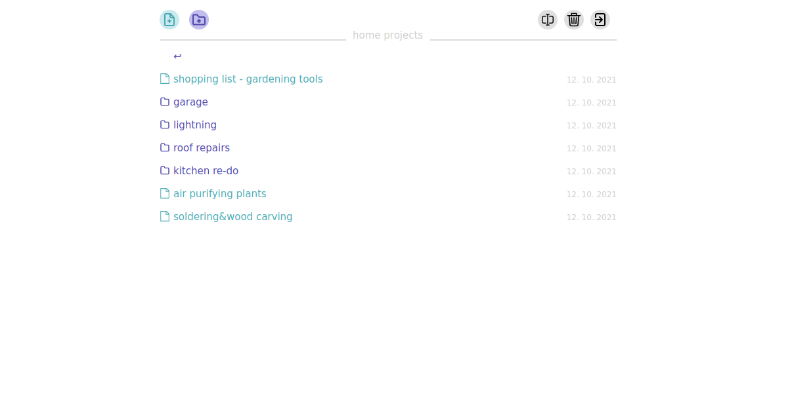

# subnotes
Simple, secure, encrypted, zero-knowledge note-taking application.
Key features:
- **no database** - everything is stored in a single encrypted vault file on a server
- **no metadata** - as the folder structure is faux and recreated from an array of objects in javascript, there are absolutely no data stored, nor exposed on transmission
- **password never touches the server** - even for the authentication, raw password is washed in hundreds salted rounds, one output is checked against the server, the other separate output is used to decrypt the vault
- **tamper-proof** - no need to trust even your neighbour, as no sensitive data leaves the client, you can let a friend install subnotes on their server for you and then compare
 checksum of javascript files loaded in your browser from said server with the ones in this github repo. This way, security is guaranteed regardless of location

### Install
Simply copy this repository on your PHP server and access its URL from the browser. No plugins required.
You will choose your password on the first opening as it recognises no hash generated on the server.
The installation is very small, but you can go even further and minify the content of data/ if you need.
**Timestamps** in the listing are using czech locale/format. You can change this to english or any other format in _data/do.js_ on line 54 in _toLocaleDateString('cs', options)_ to yours.

### Future & what am I working on
[ ] - change password option (requires reencrypting the vault)
[ ] - ability  of a user to change the order of displayed notes
[ ] - keyboard shortcuts from common text editors
[ ] - backlinking from other notes & displaying what notes link to selected one

### Get along
Merge requests are welcomed.
Get in touch with me on adam@rajnoha.com for questions, tips and chitchat.

If you wish to support me and the development, here is my BTC address:
1JGRuQqXk4me1us9iT9saw42iY1EFSbYcy

Or you can use Liberapay here:
https://liberapay.com/privacydeep/

